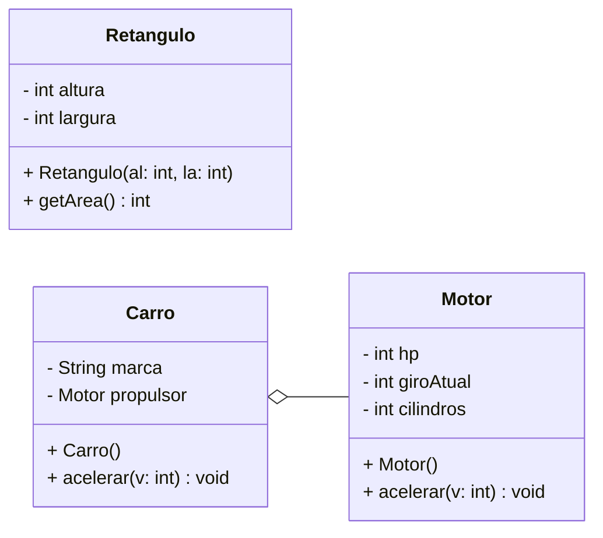

# Diagrama de classes UML

## Código Java

```java
package ads.poo;

public class Retangulo{
    private int altura;
    private int largura;

    public Retangulo (int al, int la) {
        altura = al;
        largura = la;
    }

    public int getArea() {
        return (altura * largura);
    }
}
```

## Diagrama UML

