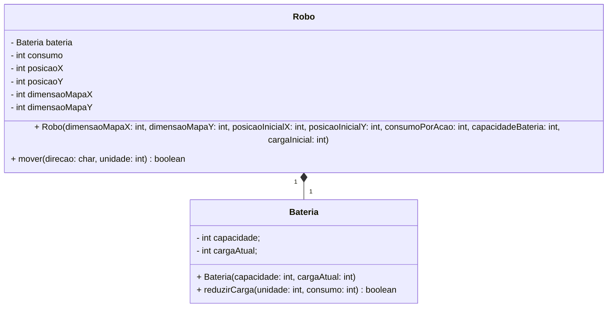

# Diagrama UML

```mermaid
classDiagram
    direction TB
    
    class Robo {
        - Bateria bateria
        - int consumo
        - int posicaoX
        - int posicaoY
        - int dimensaoMapaX
        - int dimensaoMapaY
        + Robo(dimensaoMapaX: int, dimensaoMapaY: int, posicaoInicialX: int, posicaoInicialY: int, consumoPorAcao: int, capacidadeBateria: int, cargaInicial: int)
        + mover(direcao: char, unidade: int) boolean
    }
    
    class Bateria {
        - int capacidade;
        - int cargaAtual;
        + Bateria(capacidade: int, cargaAtual: int)
        + reduzirCarga(unidade: int, consumo: int) boolean
    }
    
    Robo "1"*--"1" Bateria
```