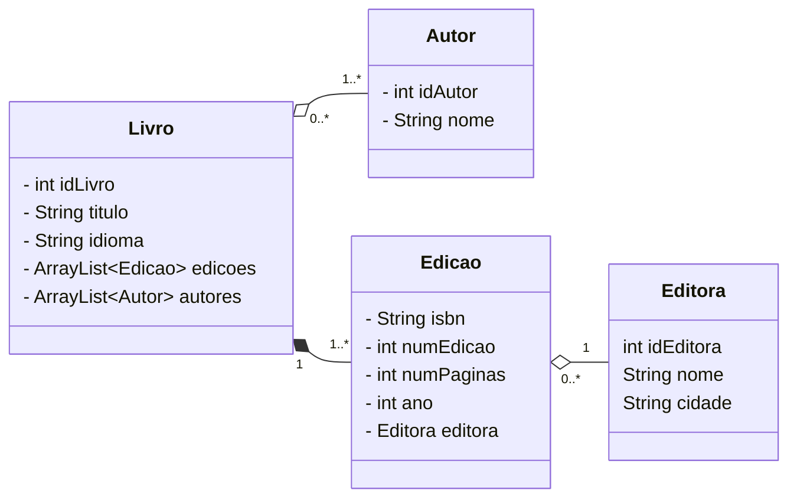
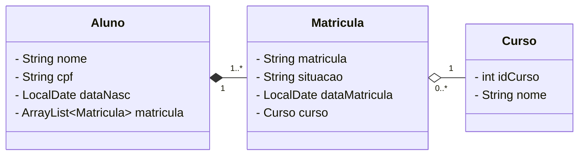
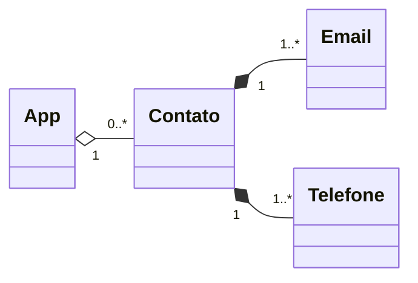

# Diagramas UML

```mermaid
classDiagram
    direction LR
    
    class Livro {
        - int idLivro
        - String titulo
        - String idioma
        - ArrayList~Edicao~ edicoes 
        - ArrayList~Autor~ autores 
    }
    
    class Autor {
        - int idAutor
        - String nome
    }
    
    class Edicao {
        - String isbn
        - int numEdicao
        - int numPaginas
        - int ano
        - Editora editora
    }
    
    class Editora {
        int idEditora
        String nome
        String cidade
    }
    
    Livro "1"*--"1..*" Edicao
    Livro "0..*"o--"1..*" Autor
    Edicao "0..*"o--"1" Editora
```

```mermaid
classDiagram
    direction LR
    
    class Aluno {
        - String nome
        - String cpf
        - LocalDate dataNasc
        - ArrayList~Matricula~ matricula
    }
    
    class Matricula {
        - String matricula
        - String situacao
        - LocalDate dataMatricula
        - Curso curso
    }
    
    class Curso {
        - int idCurso
        - String nome
    }
    
    Aluno "1"*--"1..*" Matricula
    Matricula "0..*"o--"1" Curso
```

```mermaid
classDiagram
    direction LR
    
    class App {
        
    }
    
    class Contato {
        
    }
    
    class Email {
        
    }
    
    class Telefone {
        
    }
    
    App "1"o--"0..*" Contato
    Contato "1"*--"1..*" Email
    Contato "1"*--"1..*" Telefone
```