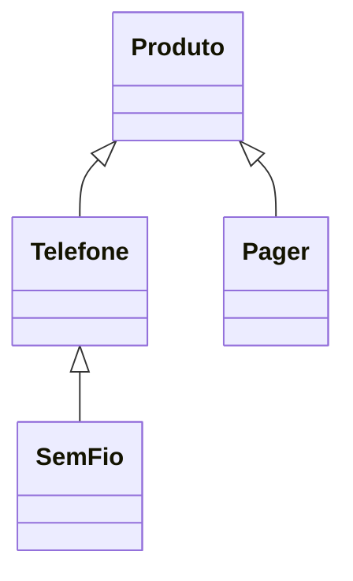
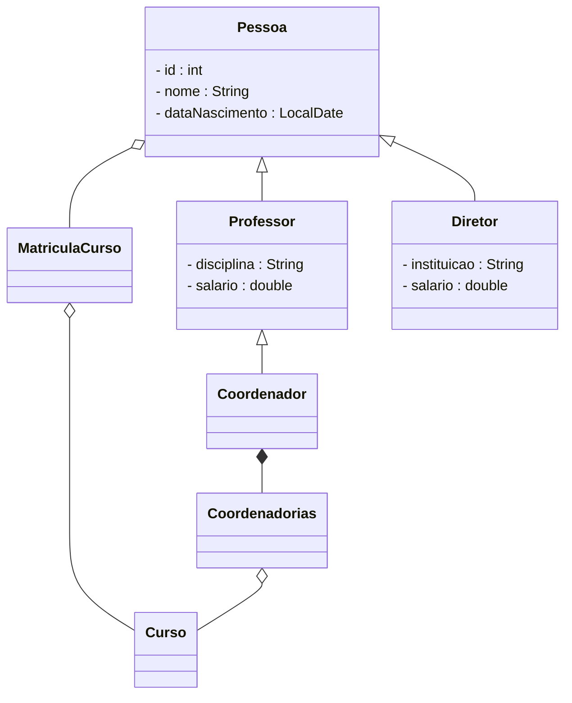
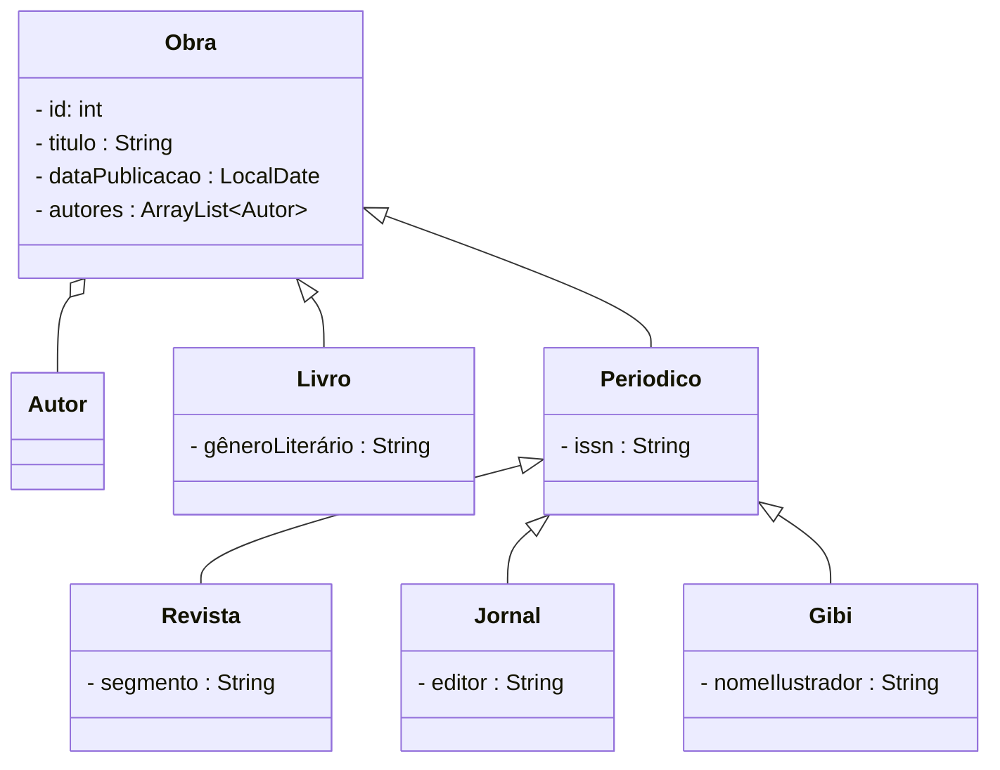
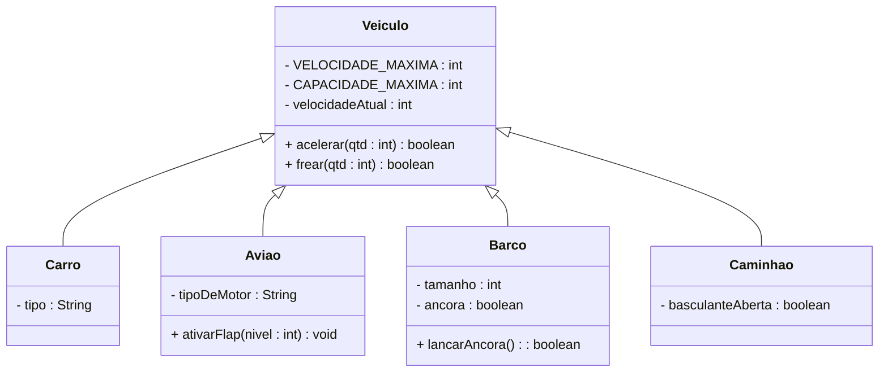

# Diagramas UML

```mermaid
classDiagram
    direction BT
    
    class Produto {
        
    }
    
    class Pager {
        
    }
    
    class Telefone {
        
    }
    
    class SemFio {
        
    }

    Telefone --|> Produto
    SemFio --|> Telefone
    Pager --|> Produto
```

```mermaid
classDiagram
    direction BT
    
    class Pessoa {
        - id : int
        - nome : String
        - dataNascimento : LocalDate
    }
    
    class Professor {
        - disciplina : String
        - salario : double
    }
    
    class Diretor {
        - instituicao : String
        - salario : double
    }

    MatriculaCurso --o Pessoa
    Curso --o MatriculaCurso
    Professor --|> Pessoa
    Coordenador --|> Professor
    Coordenadorias --* Coordenador
    Curso --o Coordenadorias
    Diretor --|> Pessoa
```

```mermaid
classDiagram
    direction BT
    
    class Obra {
        - id: int
        - titulo : String
        - dataPublicacao : LocalDate
        - autores : ArrayList~Autor~
    }
    
    class Livro {
        - gêneroLiterário : String
    }
    
    class Periodico {
        - issn : String
    }
    
    class Revista {
        - segmento : String
    }
    
    class Jornal {
        - editor : String
    }
    
    class Gibi {
        - nomeIlustrador : String
    }
    
    Autor --o Obra
    Livro --|> Obra
    Periodico --|> Obra
    Revista --|> Periodico
    Jornal --|> Periodico
    Gibi --|> Periodico
```

```mermaid
classDiagram
    direction BT
    
    class Veiculo {
        - VELOCIDADE_MAXIMA : int
        - CAPACIDADE_MAXIMA : int
        - velocidadeAtual : int
        + acelerar(qtd : int) boolean
        + frear (qtd : int) boolean
    }
    
    class Carro {
        - tipo : String
    }
    
    class Aviao {
        - tipoDeMotor : String
        + ativarFlap(nivel : int) void
    }
    
    class Barco {
        - tamanho : int
        - ancora : boolean
        + lancarAncora() : boolean
    }
    
    class Caminhao {
        - basculanteAberta : boolean
    }
    
    Carro --|> Veiculo
    Aviao --|> Veiculo
    Barco --|> Veiculo
    Caminhao --|> Veiculo
```