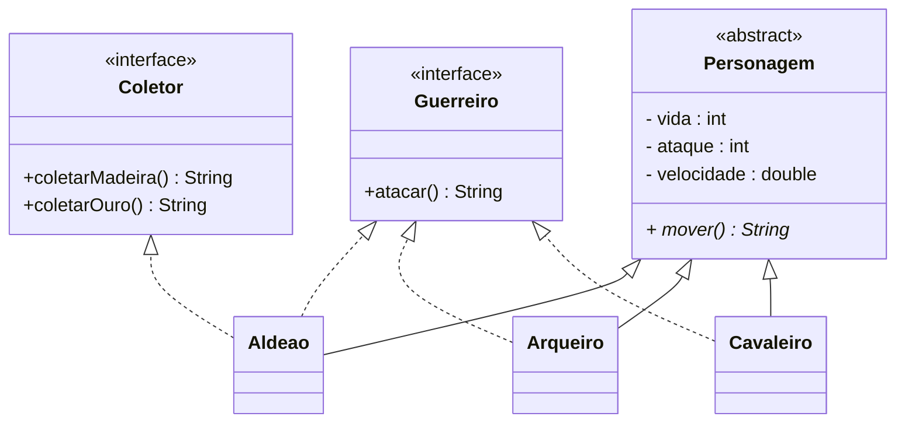
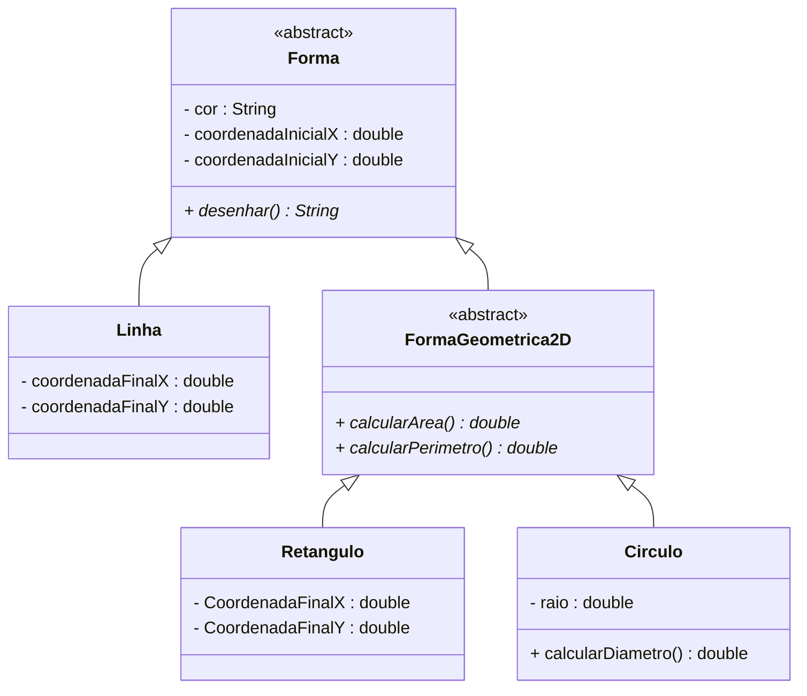

# Diagramas UML

```mermaid
classDiagram
    direction BT
    
    class Personagem {
        <<abstract>>
        - vida : int
        - ataque : int
        - velocidade : double
        + mover() String*
    }
    
    class Coletor {
        <<interface>>
        +coletarMadeira() String
        +coletarOuro() String
    }

    class Guerreiro {
        <<interface>>
        +atacar() String
    }
    
    class Aldeao {
        
    }
    
    class Arqueiro {
        
    }
    
    class Cavaleiro {
        
    }
    
    Aldeao ..|> Coletor
    Aldeao ..|> Guerreiro
    Aldeao --|> Personagem
    Arqueiro --|> Personagem
    Arqueiro ..|> Guerreiro
    Cavaleiro --|> Personagem
    Cavaleiro ..|> Guerreiro
```

```mermaid
classDiagram
    direction BT
    
    class Forma {
        <<abstract>>
        - cor : String
        - coordenadaInicialX : double
        - coordenadaInicialY : double
        + desenhar() String*
    }
    
    class FormaGeometrica2D {
        <<abstract>>
        + calcularArea() double*
        + calcularPerimetro () double*
    }
    
    class Linha {
        - coordenadaFinalX : double
        - coordenadaFinalY : double
    }

    class Retangulo {
        - CoordenadaFinalX : double
        - CoordenadaFinalY : double
    }
    
    class Circulo {
        - raio : double
        + calcularDiametro() double
    }

    Linha --|> Forma
    FormaGeometrica2D --|> Forma
    Retangulo --|> FormaGeometrica2D
    Circulo --|> FormaGeometrica2D
```