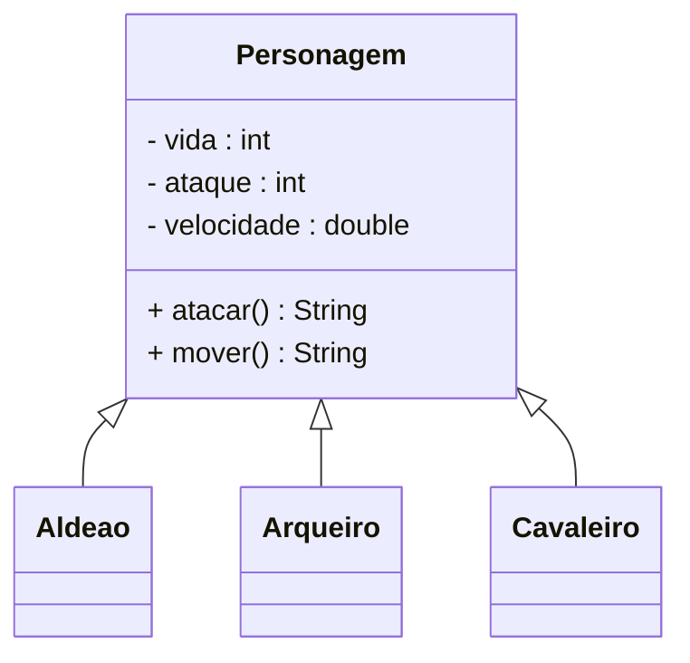

# Diagramas UML

```mermaid
classDiagram
    direction BT
    
    class Personagem {
        - vida : int
        - ataque : int
        - velocidade : double
        + atacar() String
        + mover() String
    }
    
    class Aldeao {
        
    }
    
    class Arqueiro {
        
    }
    
    class Cavaleiro {
        
    }
    
    Aldeao --|> Personagem
    Arqueiro --|> Personagem
    Cavaleiro --|> Personagem
```