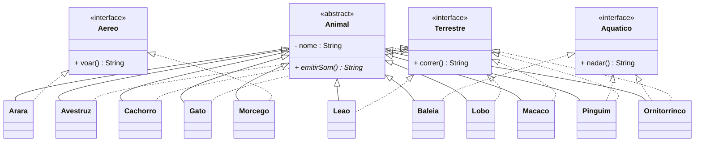

```mermaid
classDiagram
    direction BT
    
    class Animal {
        <<abstract>>
        - nome : String
        + emitirSom() String*
    }
    
    class Terrestre {
        <<interface>>
        + correr() String
    }
    
    class Aquatico {
        <<interface>>
        + nadar() String
    }
    
    class Aereo {
        <<interface>>
        + voar() String
    }
    
    class Arara {
        
    }
    
    class Avestruz {
        
    }
    
    class Baleia {
        
    }
    
    class Cachorro {
        
    }
    
    class Gato {
        
    }
    
    class Leao {
        
    }
    
    class Lobo {
        
    }
    
    class Macaco {
        
    }
    
    class Morcego {
        
    }
    
    class Pinguim {
        
    }
    
    class Ornitorrinco {
        
    }
    
    Arara --|> Animal
    Arara ..|> Aereo
    Avestruz --|> Animal
    Avestruz ..|> Terrestre
    Baleia --|> Animal
    Baleia ..|> Aquatico
    Cachorro --|> Animal
    Cachorro ..|> Terrestre
    Gato --|> Animal
    Gato ..|> Terrestre
    Leao --|> Animal
    Leao ..|> Terrestre
    Lobo --|> Animal
    Lobo ..|> Terrestre
    Macaco --|> Animal
    Macaco ..|> Terrestre
    Morcego --|> Animal
    Morcego ..|> Aereo
    Pinguim --|> Animal
    Pinguim ..|> Aquatico
    Pinguim ..|> Terrestre
    Ornitorrinco --|> Animal
    Ornitorrinco ..|> Aquatico
    Ornitorrinco ..|> Terrestre
```