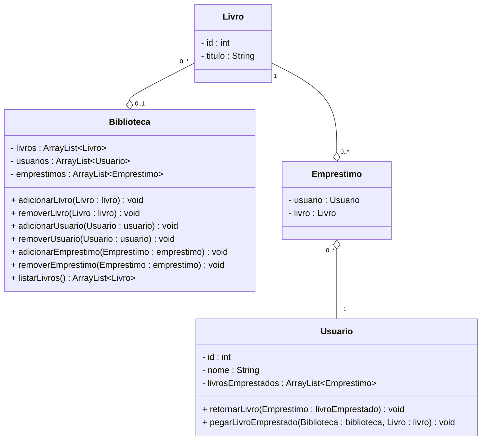

# Diagrama UML

```mermaid
classDiagram
    direction BT
    class Livro {
        - id : int
        - titulo : String
    }
    
    class Usuario {
        - id : int
        - nome : String
        - livrosEmprestados : ArrayList~Emprestimo~
        + retornarLivro(Emprestimo : livroEmprestado) void
        + pegarLivroEmprestado(Biblioteca : biblioteca, Livro : livro) void
    }
    
    class Emprestimo {
        - usuario : Usuario
        - livro : Livro
    }
    
    class Biblioteca {
        - livros : ArrayList~Livro~
        - usuarios : ArrayList~Usuario~
        - emprestimos : ArrayList~Emprestimo~
        + adicionarLivro(Livro : livro) void
        + removerLivro(Livro : livro) void
        + adicionarUsuario(Usuario : usuario) void
        + removerUsuario(Usuario : usuario) void
        + adicionarEmprestimo(Emprestimo : emprestimo) void
        + removerEmprestimo(Emprestimo : emprestimo) void
        + listarLivros() ArrayList~Livro~
    }
    
    Biblioteca "0..1"o--"0..*" Livro
    Emprestimo "0..*"o--"1" Livro
    Usuario "1"--o"0..*" Emprestimo
```