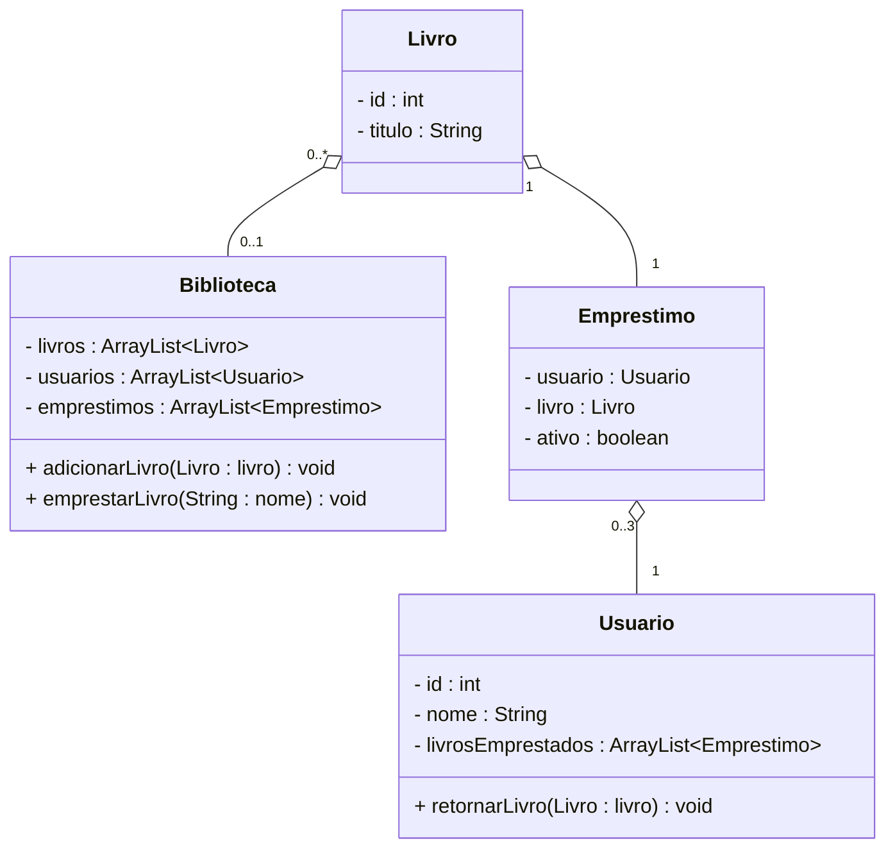

# Diagrama UML

```mermaid
classDiagram
    direction BT
    class Livro {
        - id : int
        - titulo : String
    }
    
    class Usuario {
        - id : int
        - nome : String
        - livrosEmprestados : ArrayList~Emprestimo~
        + retornarLivro(Livro : livro) void
    }
    
    class Emprestimo {
        - usuario : Usuario
        - livro : Livro
        - ativo : boolean
    }
    
    class Biblioteca {
        - livros : ArrayList~Livro~
        - usuarios : ArrayList~Usuario~
        - emprestimos : ArrayList~Emprestimo~
        + adicionarLivro(Livro : livro) void
        + emprestarLivro(String : nome) void
    }
    
    Biblioteca "0..1"--o"0..*" Livro
    Emprestimo "1"--o"1" Livro
    Usuario "1"--o"0..3" Emprestimo
```