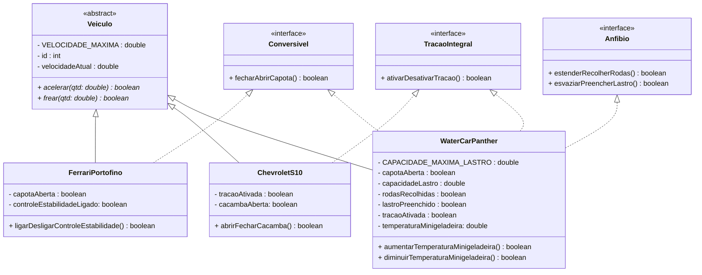

# Diagrama UML

```mermaid
classDiagram
    direction BT
    
    class Veiculo {
        <<abstract>>
        - VELOCIDADE_MAXIMA : double
        - id : int
        - velocidadeAtual : double
        + acelerar(qtd: double) boolean*
        + frear(qtd: double) boolean*
    }
    
    class Anfibio {
        <<interface>>
        + estenderRecolherRodas() boolean
        + esvaziarPreencherLastro() boolean
    }
    
    class Conversivel {
        <<interface>>
        + fecharAbrirCapota() boolean
    }
    
    class TracaoIntegral {
        <<interface>>
        + ativarDesativarTracao() boolean
    }
    
    class FerrariPortofino {
        - capotaAberta : boolean
        - controleEstabilidadeLigado: boolean
        + ligarDesligarControleEstabilidade() boolean
    }
    
    class ChevroletS10 {
        - tracaoAtivada : boolean
        - cacambaAberta: boolean
        + abrirFecharCacamba() boolean
    }
    
    class WaterCarPanther {
        - CAPACIDADE_MAXIMA_LASTRO : double
        - capotaAberta : boolean
        - capacidadeLastro : double
        - rodasRecolhidas : boolean
        - lastroPreenchido : boolean
        - tracaoAtivada : boolean
        - temperaturaMinigeladeira: double
        + aumentarTemperaturaMinigeladeira() boolean
        + diminuirTemperaturaMinigeladeira() boolean
    }
    
    FerrariPortofino --|> Veiculo
    ChevroletS10 --|> Veiculo
    WaterCarPanther --|> Veiculo
    FerrariPortofino ..|> Conversivel
    ChevroletS10 ..|> TracaoIntegral
    WaterCarPanther ..|> Anfibio
    WaterCarPanther ..|> Conversivel
    WaterCarPanther ..|> TracaoIntegral
```